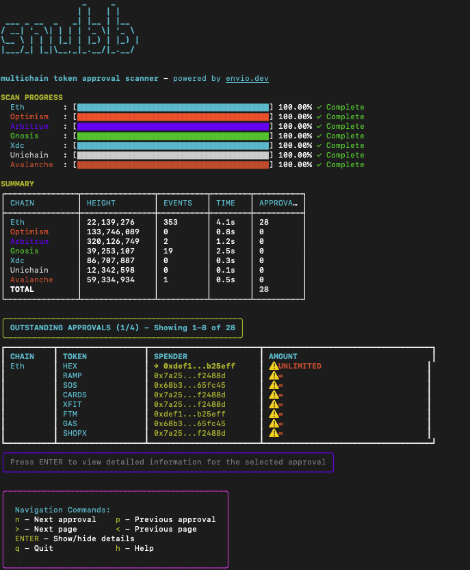

# Snubb - Multichain Token Approval Scanner

A beautiful terminal UI for scanning blockchain token approvals and tracking your exposure.



## Features

- 🔍 Scans multiple blockchains for token approvals
- 🔄 Tracks transfers that utilize these approvals
- ⚠️ Highlights unlimited token approvals (∞)
- 📊 Shows remaining allowances after transfers
- 🖥️ Slick terminal user interface with real-time stats
- 🚀 Fast scanning using Hypersync's indexing API
- 📋 Full address details view for copying to blockchain explorers

## Installation

```bash
# Install globally
npm install -g snubb

# Or use directly with npx
npx snubb --address YOUR_ETH_ADDRESS
```

## Usage

```bash
# Scan for approvals for a specific address
snubb --address 0x7C25a8C86A04f40F2Db0434ab3A24b051FB3cA58

# Get help
snubb --help
```

## Navigation

The terminal UI supports keyboard navigation:

- **n/p**: Navigate through the approval list
- **>/&lt;**: Navigate between pages
- **Enter**: Toggle detailed view for an approval
- **h**: Show help screen
- **q**: Quit the application

When an approval is selected, the full token and spender addresses are shown in the details panel, allowing you to copy the complete addresses for use in blockchain explorers.

## Understanding the Results

The tool scans for two types of events:

1. **Approval events** - When you authorize a contract/address to spend your tokens
2. **Transfer events** - When tokens move from your wallet (potentially using those approvals)

The results show:

- **Token Address** - The contract address of the token
- **Spender** - The address authorized to spend your tokens
- **Approved** - The amount you've approved for spending
- **Used** - How much the spender has already used
- **Remaining** - The current remaining approval (what you're still exposed to)

## Security Recommendations

1. **Revoke unnecessary approvals**, especially those with unlimited amounts
2. **Use token allowance services** like revoke.cash or etherscan's token approval tool
3. **Be cautious with unlimited approvals** (∞) as they represent unlimited access to that token

## Development

```bash
# Clone the repository
git clone https://github.com/your-username/snubb.git

# Install dependencies
cd snubb
npm install

# Run locally
node index.js --address YOUR_ETH_ADDRESS
```

## License

ISC
